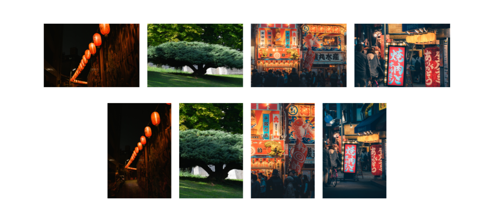

# React Three Fiber and three.js Image Cover 

The aim of this repo is to implement an efficient and reliable way to put as a texture pictures in PlaneGeometries, without any stretching.
The effect is similar to the property `background-size: cover;` in CSS, but for a three.js usage.

The code is made with react-three-fiber, but all is about creating a ShaderMaterial corresponding to the need and to precalculate the uniforms CPU side.



# Process
For people not used to react-three-fiber, I don't want you to get overwhelmed so here is what you need to calculate in native three.js to get the exact same result.

The main logic is fully contained here:

```ts
const calculateScaleFactors = (texture: Texture, containerSize: Vector2) => {

  const containerAspectRatio = containerSize.x / containerSize.y;
  const imageAspectRatio = texture.image.width / texture.image.height;

  let scaleFactorX = 1;
  let scaleFactorY = 1;

  const landscapeFactor = imageAspectRatio / containerAspectRatio;
  const portraitFactor = containerAspectRatio / imageAspectRatio;

  const isLandscapeModeContainer = containerAspectRatio >= 1;
  const isContainerRatioStronger = containerAspectRatio >= imageAspectRatio;


  if (isContainerRatioStronger) {
    scaleFactorY = isLandscapeModeContainer ? landscapeFactor : portraitFactor;
  } else {
    scaleFactorX = isLandscapeModeContainer ? landscapeFactor : portraitFactor;
  }

  return {scaleFactorX, scaleFactorY}
}
```

where `containerSize` is the width and height of the PlaneGeometry in three.js units. 

Once the scale factors are calculated, you can pass them as uniform in a regular `ShaderMaterial` as follow:

```ts
const uniforms = {
      uTexture: {
        value: texture
      },
      uScaleFactorX: {
        value: scaleFactorX
      },
      uScaleFactorY: {
        value: scaleFactorY
      }
}
```

Nothing is done in the `vertexShader`, only passing the UVs to the fragment shader.

```glsl

uniform sampler2D uTexture;

varying vec2 vUv;

void main() {
    vUv = uv;
    gl_Position = projectionMatrix * viewMatrix * modelMatrix * vec4(position, 1.0);
}

```

```glsl
// fragment shader
uniform sampler2D uTexture;

uniform float uScaleFactorX;
uniform float uScaleFactorY;

varying vec2 vUv;

void main() {

    vec2 st = (vUv * 2.0 - 1.0); //Centering the UVs space between -1 and 1 to apply the scaling.
    
    // Scale the UVs so the width or the height is overflowing the plane.
    // The other stays at 1 so it fully takes place on the dimension of the plane.
    st.x *= uScaleFactorX; 
    st.y *= uScaleFactorY;

    // Put back the UVs space between """0 and 1 range""" so the texture image is covering the plane nicely.
    st = st * 0.5 + 0.5;

    gl_FragColor = texture(uTexture, st);
}
```
